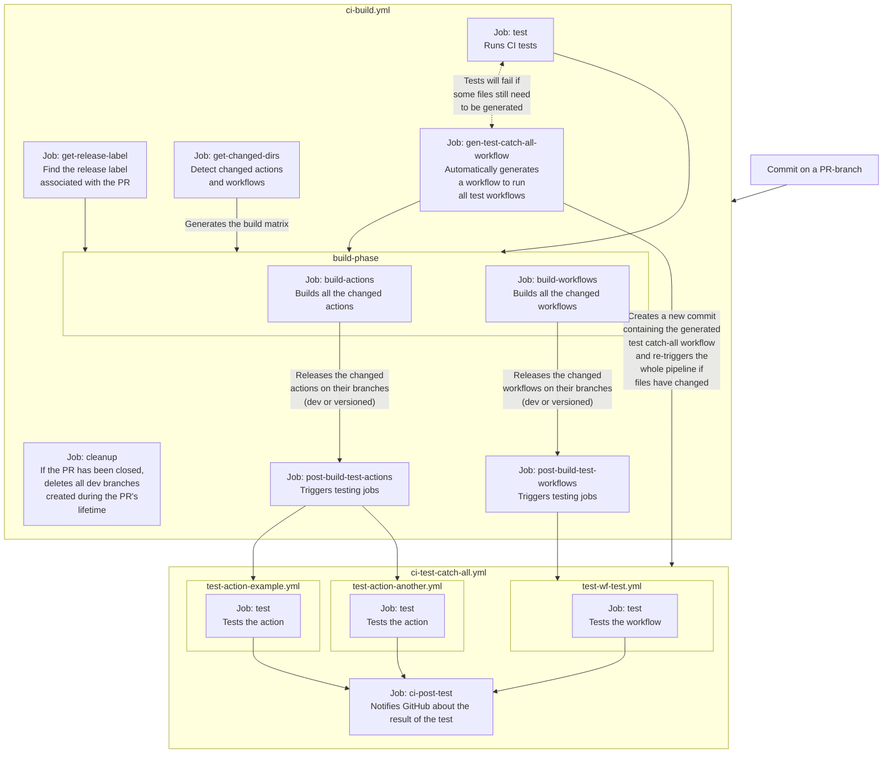

# cmaster11/gha/.github/workflows/wf-build.yml

The `wf-build.yml` is an opinionated all-in-one GitHub Actions shared workflow that allows you to build a monorepo
containing versioned GitHub shared actions and reusable workflows.

> The [`cmaster11/gha`](https://github.com/cmaster11/gha) repository is entirely built on top of this workflow.

## What comes as a result of using this workflow?

You will be able to generate both composite and JS versioned shared
actions:

```yaml
jobs:
  test:
    name: Run the test action
    runs-on: ubuntu-latest
    steps:
      - uses: cmaster11/gha@action-test/v1
```

You will be able to generate versioned reusable workflows:

```yaml
jobs:
  my-job:
    uses: cmaster11/gha/.github/workflows/wf-test.yml@wf-test/v1
```

## How do you use it?

The prerequisites for being able to use this workflow are as follows:

1. Having an `actions` folder, which will contain all your shared actions.
2. (optional but highly recommended) Having a JSSETUP

Create a workflow named (for example) `.github/workflows/gha-build.yml` with the following contents:

<!-- import:ci-pr.yml BEGIN -->

```yaml
name: CI - Build on PR

on:
  pull_request:
    branches:
      - main
    types:
      - opened
      - synchronize
      - reopened
      - closed
      # Triggers the workflow when labels change in the PR
      - labeled

jobs:
  build:
    uses: cmaster11/gha/.github/workflows/wf-build.yml@wf-build/v1
    permissions:
      # Required to create new version branches
      contents: write
      # Required to publish comments on the PR
      pull-requests: write
      # Required to trigger test workflows via workflow_dispatch
      actions: write
      # Required to create commit statuses to mark the
      # execution of test workflows
      statuses: write

    secrets:
      # You need to provide a PAT to enable auto-generation of the
      # catch-all test workflow. This can be a PAT of a GitHub app,
      # generated dynamically for every run in a previous job, or a user PAT.
      #
      # This token needs to have the `contents: write` and `workflows: write` permissions.
      #
      # If using a user PAT, I recommend creating a fine-grained token scoped only
      # to your GHA repository with only the contents/workflows `write` permissions.
      token-push-workflows: ${{ secrets.CI_BUILD_TOKEN_WORKFLOWS }}

    with:
      # You can customize various commands
      test-command: npm run test:ci

      # If you want to disable linting
      # lint-command: echo NOOP

      # Or you can completely disable testing, in case you want to run your
      # own test suites before running the actions/workflows build pipeline.
      # skip-test: true
```

<!-- import:ci-pr.yml END -->

## Testing

You can create test workflows for every shared action and reusable workflow.

The testing flow is the same for both shared action and reusable workflows, as both are executed after
the build phase.

### Test workflows (shared actions)

The name of the test workflow needs to be `.github/workflows/test-ACTION-NAME.yml`.

Here you can see an example of a test workflow built to test a shared action:

<!-- import:test-action-test.yml BEGIN -->

```yaml
name: Test action-test
on:
  workflow_call: { inputs: { test-ctx: { type: string } } }

jobs:
  test:
    runs-on: ubuntu-22.04
    steps:
      - name: Checkout the dev branch
        uses: actions/checkout@v4
        with:
          ref: "${{ fromJSON(inputs.test-ctx).ref }}"

      - name: Run the action
        id: action
        uses: ./
        with:
          greeting: Hello world!

      - name: Dump the result of the action
        run: |
          echo "$JSON" | jq '.'
        env:
          JSON: ${{ toJSON(steps.action) }}
```

<!-- import:test-action-test.yml END -->

### Test workflows (reusable workflows)

The name of the test workflow needs to be `.github/workflows/test-WORKFLOW-NAME.yml`.

Here you can see an example of a test workflow built to test a reusable workflow:

<!-- import:test-wf-test.yml BEGIN -->

```yaml
name: Test wf-test

on:
  workflow_call: { inputs: { test-ctx: { type: string } } }

jobs:
  test:
    # Invoke the reusable workflow
    uses: ./.github/workflows/wf-test.yml

  dump:
    needs: test
    runs-on: ubuntu-latest
    steps:
      - name: Dump the result of the workflow
        run: |
          echo "$JSON" | jq '.'
        env:
          JSON: ${{ toJSON(needs.test) }}
```

<!-- import:test-wf-test.yml END -->

**Do note** this way of testing will have GitHub use the workflow defined in the **last commit** of the current PR, and
not in the commit for which the whole flow was triggered. This is just a nit and not a big deal because
the `wf-build.yml` workflow defines a strict `concurrency` policy, which means any new commit will cause all previous
test flows to be cancelled.

### `test-ctx`

The `test-ctx` structure is defined as follows:

<!-- import:../../lib/ci/ci-shared-test-payload.ts BEGIN -->

```ts
export interface TestPayload {
  // The SHA of the HEAD commit
  sha: string;
  // The git ref of the branch we are on
  ref: string;
  // The number of the current PR
  pullNumber: number;

  // The context of the commit status associated with the test
  commitStatusContext: string;
}
```

<!-- import:../../lib/ci/ci-shared-test-payload.ts END -->

## Architecture

<!-- NOTE: the diagram is stored in `../../ARCHITECTURE.mermaid` -->

<!-- import:../../ARCHITECTURE.mermaid BEGIN -->



<!-- import:../../ARCHITECTURE.mermaid END -->
