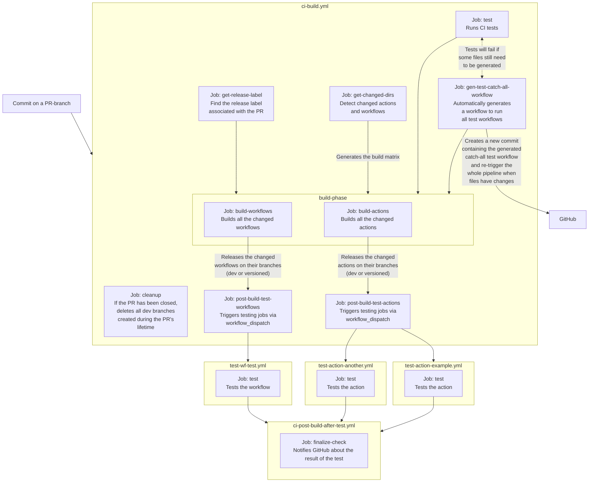

# GitHub Actions and reusable workflows

The `cmaster11/gha` repository contains various GitHub Actions, reusable workflows, and a build
system to version them all.

## Actions

<!-- GENERATE_ACTIONS BEGIN -->

- [`action-ci-build`](./actions/action-ci-build): An internal helper for the ci-build.yml workflow.
- [`action-example`](./actions/action-example): This is just an example action.
- [`action-get-changed-dirs`](./actions/action-get-changed-dirs): Uses git diff to find the list of changed directories, compared to a previous commit SHA.
- [`action-get-release-label`](./actions/action-get-release-label): This actions looks for any release labels such as: patch, minor, major, no-release. It will fail it no labels are found.
- [`action-git-init-userinfo`](./actions/action-git-init-userinfo): Sets the user name and email for git to use. Defaults to a GitHub actions user.
- [`action-test`](./actions/action-test): This is just a test action.
<!-- GENERATE_ACTIONS END -->

## Workflows

<!-- GENERATE_WORKFLOWS BEGIN -->

- [`wf-build`](./.github/workflows/wf-build.yml): Build Github Actions and reusable workflows
- [`wf-create-release`](./.github/workflows/wf-create-release.yml): Creates a release from an artifact into a standalone branch
- [`wf-test-subworkflows`](./.github/workflows/wf-test-subworkflows.yml): A test workflow, used to test sub-workflows
- [`wf-test`](./.github/workflows/wf-test.yml): A test workflow
- [`workflow-test`](./.github/workflows/workflow-test.yml): A test workflow (extended file name)
<!-- GENERATE_WORKFLOWS END -->

## Development (actions)

1. Create a new action in the `actions` folder (e.g. `action-test`).
2. Create PR and assign a release label (`patch`, `minor`, `major`).
   1. Note that **versions start from 0**, which means that, if you want to release a `v1`, you will need to use
      a `major` label in the PR.
3. On PR merge, the action will be built and released to its own version branch (e.g. `action-test/v1`).
4. You can then use the action in a GitHub Actions workflow with:

```yaml
jobs:
  my-job:
    runs-on: ubuntu-latest
    steps:
      - uses: cmaster11/gha@action-test/v1
```

### Additional files

Any file stored in the action folder will be moved to the root of the repository in the release branch, which means
that if the action folder contains a `README.md` file, it will become the main README of the repo.

### Pure NodeJs actions

Create an `index.ts` file in the action folder and use the following configuration for the `action.yml` file:

```yaml
runs:
  using: node20
  main: index.ts
```

## Development (workflows)

1. Create a new workflow in the `.github/workflows` folder, making sure its name starts either with `wf-` or `workflow-` (
   e.g. `wf-test` or `workflow-test`).
2. Create PR and assign a release label (`patch`, `minor`, `major`).
   1. Note that **versions start from 0**, which means that, if you want to release a `v1`, you will need to use
      a `major` label in the PR.
3. On PR merge, the workflow will be released to its own version branch (e.g. `wf-test/v1` or `workflow-test/v1`).
4. You can then use the workflows in a GitHub Actions workflow with:

```yaml
jobs:
  my-job:
    uses: cmaster11/gha/.github/workflows/wf-test.yml@wf-test/v1
```

### Additional files

Assuming your workflow's name is `wf-test.yml`:

#### README

If a file such as `wf-test.README.md` is found, it will be moved to the root of the repository in the release
branch and renamed to `README.md`, which means it will become the main README of the repo.

#### Sub-workflows

Any other workflows contained in the `.github/workflows` folder whose name starts with the main workflow's name and
continues after a `.` will be also released together with the main workflow.

E.g., You could have another workflow such as `wf-test.another.yml`.

This makes it possible to have a main workflow that triggers any amount of dependent ones without having to worry about
versioning.

You can then reuse these sub-workflows in your main one with:

```yaml
jobs:
  parse:
    uses: ./.github/workflows/wf-test.another.yml
```

## Build pipeline


