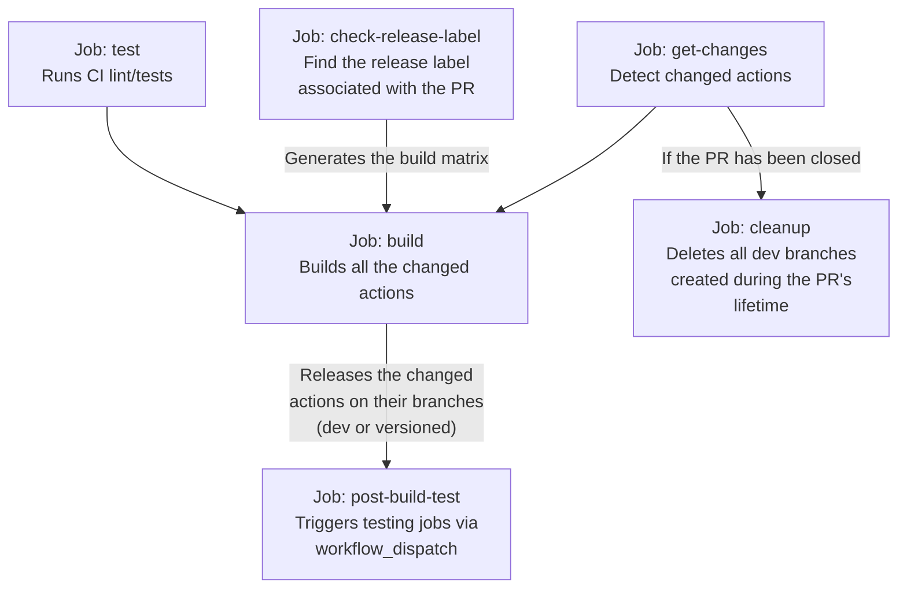

# GitHub shared actions and workflows

Workflows:

* [workflow-create-release](.github/workflows/test-workflow-create-release.yaml): Creates a release from an artifact
  into a standalone branch

## Pipeline



## Development

### Pure NodeJs actions

Create an `index.mts` file in the action folder and use the following configuration for the `action.yml` file:

```yaml
runs:
  using: node20
  main: dist/index.mjs
```