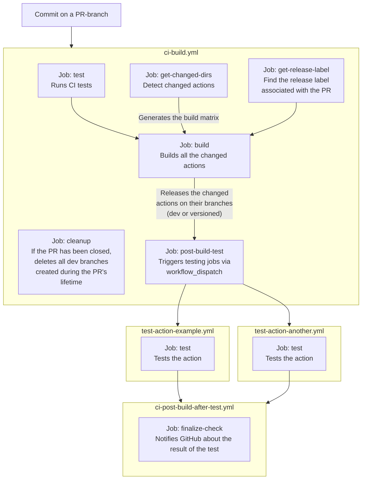

# GitHub Actions and reusable workflows

The `cmaster11/gha` repository is a container of various GitHub Actions. It provides also a build
system to version and release such Actions!

## Actions

<!-- GENERATE_ACTIONS BEGIN -->

- [`action-ci-build`](./actions/action-ci-build): An internal helper for the ci-build.yml workflow.
- [`action-example`](./actions/action-example): This is just an example action.
- [`action-get-changed-dirs`](./actions/action-get-changed-dirs): Uses git diff to find the list of changed directories, compared to a previous commit SHA.
- [`action-get-release-label`](./actions/action-get-release-label): This actions looks for any release labels such as: patch, minor, major, no-release. It will fail it no labels are found.
- [`action-git-init-userinfo`](./actions/action-git-init-userinfo): Sets the user name and email for git to use. Defaults to a GitHub actions user.
- [`action-test`](./actions/action-test): This is just a test action.
<!-- GENERATE_ACTIONS END -->

## Workflows

<!-- GENERATE_WORKFLOWS BEGIN -->

- [`workflow-create-release`](./.github/workflows/workflow-create-release.yml): Creates a release from an artifact into a standalone branch
- [`workflow-test`](./.github/workflows/workflow-test.yml): A test workflow
<!-- GENERATE_WORKFLOWS END -->

## Development

1. Create a new action in the `actions` folder (e.g. `action-test`).
2. Create PR and assign a release label (`patch`, `minor`, `major`).
   1. Note that **versions start from 0**, which means that, if you want to release a `v1`, you will need to use a `major` label in the PR.
3. On PR merge, the action will be built and released to its own version branch (e.g. `action-test/v1`).
4. You can then use the action in a GitHub Actions workflow with:

```yaml
jobs:
  my-job:
    runs-on: ubuntu-latest
    steps:
      - uses: cmaster11/gha@action-test/v1
```

### Pipeline



### Pure NodeJs actions

Create an `index.ts` file in the action folder and use the following configuration for the `action.yml` file:

```yaml
runs:
  using: node20
  main: index.ts
```
